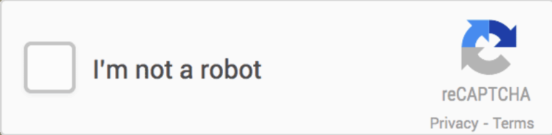

.. ==================================================
.. FOR YOUR INFORMATION
.. --------------------------------------------------
.. -*- coding: utf-8 -*- with BOM.

.. include:: ../Includes.txt

What does it do?
================

This extension will integrate the Google reCAPTCHA anti-spam solution into EXT:powermail.

Adding the reCAPTCHA field to a Powermail-form, will give you the possibility to check if the user is a human being and not a spambot. reCAPTCHA will let the visitor set a checkbox that he or she is a human. When reCAPTCHA has its doubts if this is a real human, it will show a question to select the pictures with a specific subject. For example: select the photos with a boat on it. When the visitor choose the right photo's, the form can be submitted.

	reCAPTCHA Form

More information about Google reCAPTCHA can be found on the website https://www.google.com/recaptcha/intro/index.html